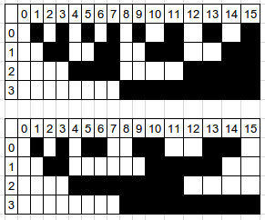
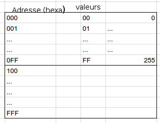
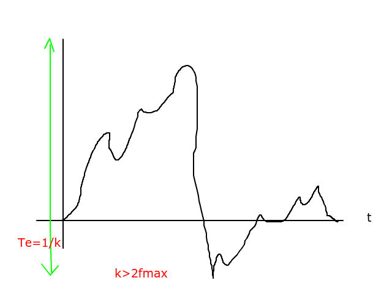

## Compression sans perte

### CLV - synchronisation

### Algo de Shannon-Faro (codeur entropique)

### Algo d'Huffman (codeur entropique)

### Codage par plage

#### RLE (Run Length Encoding)

**Principe :** Regrouper les pixels voisins ayant le même niveau de gris.
Couples : $Q_{i} = \left\{ P_{i},l_{i} \right\}$ avec P~i~ intensité, l~i~ longueur de la plage. Information codée à l'ordre 2.

*Exemple :* ligne d'image :
50 50 50 50 52 52 52 50 50 50 48 48 50
Q~0~(50,4) Q~1~(52,3) Q~2~(50,3) Q~4~(50,1)
Origine de l'image : 

- APN : plages très courtes
- Synthèse : intéressant

$0\leq l_{i} \leq 255$
$1\leq l_{i} \leq n=M*N$
Les couples qui apparaissent souvent seront codés avec des codes petits par Huffman.

#### Plans binaires + RLE

Décomposition image ndg -> n plans binaires (MSB, LSB)

1. Longueur max de plage : l~max~MSB >> l~max~LSB
2. Ordre 2 -> Ordre 1; 
Q~i~={p~i~, l~i~} -> {l~i~}; 
0 $\rightarrow$ 1 , 1 $\rightarrow$ 0;

	- L~7~ = 64 bits
	- L~6~ = 32 bits
	- L~4~ = 16 bits
	- L~3~ = 8 bits
	- 0 $\leq$ L~2~ $\leq $ 4 bits
	- L~0~ = L~1~ = 0 non utilisé

LSB~1~, LSB~2~; 
00 01 10 11; 
pas de plage $\rightarrow$ codage de Huffman;

*Problème :* niveau de gris 127 $\rightarrow$ 128 : 01111111 $\rightarrow$ 10000000. Rupture sur tous les plans

*Solution :* ~~Codage binaire~~ Code de Gray. Variation d'un seul bit entre 2 valeurs binaires

*Ex :* 4 bits

 

### Codage à base de dictionnaire

#### Codage statique (LZ)

Construction d'un dictionnaire.

- liste de motifs : fonction du flux de données.

*Ex : Fichiers texte : mise en service de véhicules*

MMAA (véhicules de moins de 10 ans); 
{0,...,9} -> alphabet 10 symboles; 
4 évènements : MMAA; 
1 symbole : 4 bits; 
2^4x4^ = 65536 mots possibles; 
Application : 12 mois x 10 = 120 mots; 
MMAA : 10 symboles et 4 évènements;
10^4^ : 2^13^<10^4^>2^14^; 
16 bits ->  14 biyts; 
01 $\leq$ MM $\leq$ 12 , 12 mois; 
06 $\leq$ AA $\leq$ 15 , 10 années de mise en service; 
12x2=120 mots : 14 bits -> 7 bits, 120 < 2^7^; 
Si véhicule de plus de 10 ans : codage brut; 
Ajout d'un bit de signalisation : 0 si mot $\in$ dictionnaire, 1 sinon.

*Ex :* mot appartenant au dico : $\color{orange} {0}1110010$; 
mot n'apartenant pas au dico (véhicule + 10 ans) $\color{orange} {1}0001001000010011$;

#### Codage à fenêtre glissante (LZ77 Lempel Ziv en 1977)

*mémoire :* taille de fenêtre

#### Codage dynamique (LZW Lempel Ziv Welch)

Dictionnaire quasi vide au départ, qu'on va remplir au fur et à mesure de la lecture.

 

**Algo :**

	//1. Initialisation
	i = 0;
	c = lireCaractereSuivant();

	//2
	i++; j=1;
	C(i,j)=c; chaine=c;

	//3
	c=lireCaractereSuivant();
	chaine+c € Table ?
		oui:
			j++; C(i,j)=c;
			chaine += C(i,j);
			retour en 3;
		non:
			code = &chaine;
			1ere &libre = chaine+c;
			retour en 2;

*Ex :* ligne d'image : 20 31 0A 20 31 0A 20

| chaine+c | $\in$ table ? |              | Nouvelle adresse |
|:--------:|:---------:|:------------:|:----------------:|
| 20,31    | non       | @20 = 020    | @2031 = 100      |
| 31, 0A   | non       | @31 = 031    | @310A = 101      |
| 0A, 20   | non       | @0A = 00A    | @0A20 = 102      |
| 20,31    | oui       |              |                  |
| 20,31,0A | non       | @2031 = 100  | @20310A = 103    |

### Codage prédictif

*Idée :* entre 2 pixels : pas de différences

n~p~ pixel; n'~p~ pixel voisin; $\xi$ = n~p~-n'~p~

On ne transmet que la différence

*Idée :* Faire une première lecture de l'image. Adapter la prédiction pour chaque pixel de l'image.

## Compression avec pertes

### Quantification

