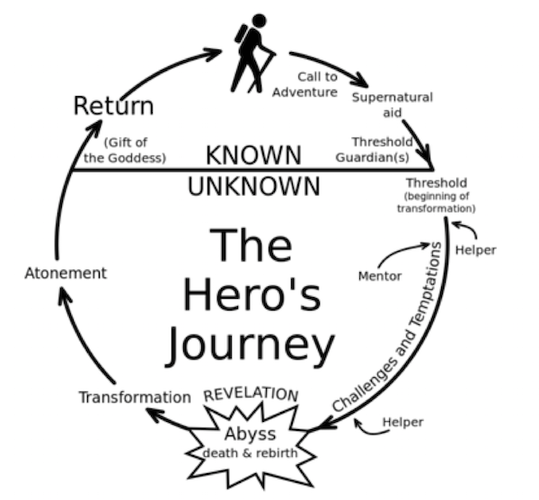

***Rappel :*** *Phases de production d'un jeu*

1. Concept
2. Développement
	- Game Design Document
	- Gameplay
	- Level
3. Pré production
	- Prototype
4. Si $ OK
5. Production
6. Distribution
7. Maintenance
8. Post Mortem

# Level Design

## Théorie du monomythe

Joseph Campbell. *Héros aux mille visages*, 1949. Il a cherché un pattern commun sur les mythes.

Cette théorie repose sur 4 points fondamentaux

- Psyché inconcsiente/archetypes (rêve)
	- Théorie d'archétypes
	- Référence à Dr. Jung "une forme de représentation donnée à priori refermant un thème universel, commun à toutes les cultures humaines mais figuré sous des formes symboliques diverses, et structurant la psyché inconsciente.
- Itinéraire du héros
	- L'aventure mythologique suis un itinéraire type
		- Séparation
		- Inititation
		- Retour
	- Unité nucléaire du mythe
- La katharsis tragique
	- Purification/Purgation des émotions au moyen de la pitié et de la  terreur
	- Tragédie & Comédie
- Nombril du monde
	La réussite du héros libère le flot vital; un renouveau dans le monde

 

