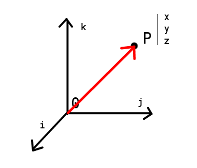
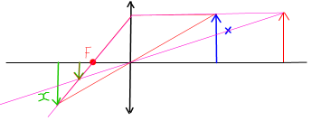
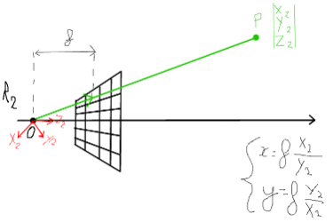

# Introduction générale

## Rappels de géométrie

$\overrightarrow{OP} = X\overrightarrow{i} +  Y\overrightarrow{j} + Z\overrightarrow{k}$

$\left(\begin{array}{c}X_{2}\\ Y_{2}\\ Z_{2}\end{array}\right) = \begin{bmatrix}  &  &  \\  &R & \\ & &  \end{bmatrix}\begin{bmatrix}X_{1}\\ Y_{1}\\ Z_{1} \end{bmatrix} + T$

$P_{2} = RP_{1} + T$

$P_{2}-T= RP_{1}$

$R^{-1}(P_{2}-T)=P_{1}$

$R^{T}(P_{2}-T)=P_{1}$

$R^{T}P_{2}-R^TT = P_{1}$

## Formation des images

$\frac{x}{f} = \frac{X}{Z} \rightarrow \begin{cases}x = f\frac{X}{Z}\\y = f\frac{Y}{Z}\end{cases}$

 
 

## Modèles des caméras

$u = k_{u}x+u_{0} = k_{u}f\frac{X_{c}}{Z_{c}}+u_{0}$ avec $\color{blue} {\alpha_{u}=k_{u}f}$
$v = k_{v}y+v_{0} = k_{v}f\frac{Y_{c}}{Z_{c}}+v_{0}$ avec $\color{blue}{\alpha_{v}=k_{v}f}$

$\left(\begin{array}{c}u\\ v\end{array}\right)\rightarrow\left(\begin{array}{c}U\\ V\\ S\end{array}\right)\rightarrow\begin{cases}u = \frac{U}{S}\\v = \frac{V}{S}\end{cases}$

$\left(\begin{array}{c}U\\ V\\ S\end{array}\right)=\lambda \left(\begin{array}{c}\alpha_{u} & 0 & u_{0} & 0\\ 0 & \alpha_{v} & v_{0} & 0 \\ 0&0&1&0\end{array}\right)\left(\begin{array}{c}X_{c}\\ Y_{c}\\Z_{c}\\1\end{array}\right)$

## Étalonnage (Calibration)

$\rightarrow$ retrouver les paramètres de $\begin{bmatrix}C_{c} \end{bmatrix}$

> système de mire

